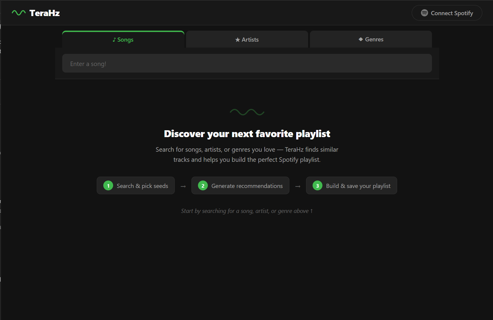
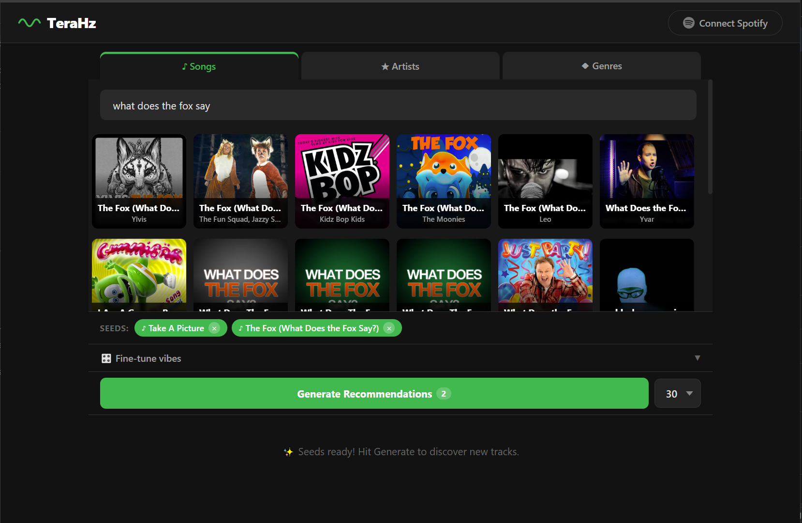
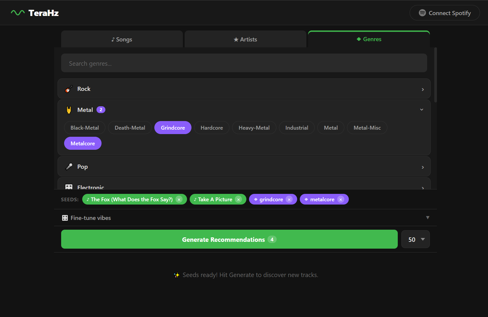
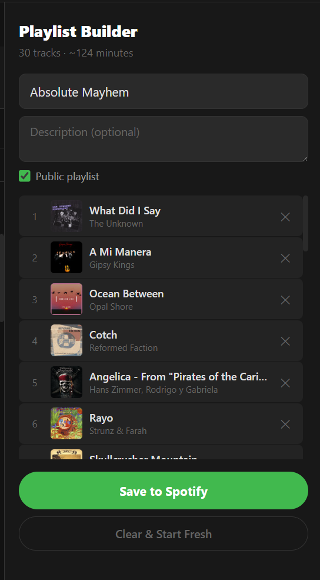

# TeraHz

> Discover your next favorite playlist — powered by Spotify + Last.fm

TeraHz is a web app for building Spotify playlists based on songs, artists, genres, and vibes. It combines the Spotify Web API with Last.fm's music similarity data to generate track recommendations and save them directly to your Spotify account.



---

## How It Works

TeraHz follows a simple three-step flow:

### 1. Search & Pick Seeds

Switch between **Songs**, **Artists**, and **Genres** tabs to find music you like. Each selection becomes a "seed" that shapes your recommendations.

| Songs & Artists | Genre Categories |
|:---:|:---:|
|  |  |

Search for songs or artists by name — results appear instantly from Spotify. The genre picker organizes 120+ genres into 14 collapsible categories (Rock, Metal, Pop, Electronic, Hip-Hop, etc.) with a search filter to find exactly what you want.

Your selected seeds appear as colored pills below the search area:


### 2. Fine-Tune & Generate

Optionally open the **vibe tuning** panel to select mood tags like Chill, Energetic, Acoustic, or Fast BPM. These map to Last.fm tags that steer the results toward a specific feel.


Choose how many tracks to generate (10–100) and hit **Generate Recommendations**. TeraHz runs both Spotify search and Last.fm similarity in parallel, deduplicates results, and presents a combined list.


Each track shows album art, artist, and duration. Tap **+** to add a track to your playlist.

### 3. Build & Save Your Playlist

As you add tracks, the playlist panel slides in on the right. Name your playlist, add a description, toggle public/private, and connect your Spotify account to save.



---

## Features

| Feature | Description |
|---|---|
| **Seed-based recommendations** | Add songs, artists, and genres as seeds. Both Spotify and Last.fm power the results. |
| **Vibe tuning** | 10 mood chips (Danceable, Energetic, Chill, Acoustic, Upbeat, Melancholy, Fast/Slow BPM, Instrumental, Vocal) |
| **Genre categories** | 120+ genres in 14 collapsible groups with search |
| **Variable track count** | Generate 10, 20, 30, 50, 75, or 100 tracks per request |
| **Playlist creation** | Custom name, description, public/private — saved straight to Spotify |
| **OAuth integration** | Connects to your Spotify account with state preserved across the login redirect |
| **HTTPS support** | Optional SSL/TLS with automatic HTTP→HTTPS redirect |

## Architecture

TeraHz is a single-server full-stack app:

- **Backend**: Express.js serving both the API and the built React frontend
- **Frontend**: React 18 (Create React App), built to static files and served by Express
- **APIs**: Spotify Web API (search, playlists, user data) + Last.fm API (track/artist similarity, tag-based discovery)

## Prerequisites

- [Node.js](https://nodejs.org/) v16 or later
- A [Spotify Developer](https://developer.spotify.com/dashboard) application (free)
- A [Last.fm API key](https://www.last.fm/api/account/create) (free)

## Setup

1. **Clone the repository**

   ```bash
   git clone https://github.com/your-username/TeraHz.git
   cd TeraHz
   ```

2. **Create your environment file**

   Copy the example and fill in your credentials:

   ```bash
   cp .env.example .env
   ```

   Edit `.env`:

   ```dotenv
   SPOTIFY_CLIENT_ID=your_spotify_client_id
   SPOTIFY_CLIENT_SECRET=your_spotify_client_secret
   LASTFM_API_KEY=your_lastfm_api_key
   PORT=3000
   SSL_KEY_PATH=
   SSL_CERT_PATH=
   ```

3. **Configure Spotify redirect URI**

   In your [Spotify Developer Dashboard](https://developer.spotify.com/dashboard), add a redirect URI matching your server:

   - Local development: `http://127.0.0.1:3000/auth/callback`
   - With a domain: `https://yourdomain.com:3000/auth/callback`

4. **Install dependencies and build**

   ```bash
   npm install
   npm run build
   ```

   This installs server dependencies, then installs client dependencies and builds the React app.

5. **Start the server**

   ```bash
   npm start
   ```

   Open `http://127.0.0.1:3000` (or your configured domain) in a browser.

## HTTPS / SSL

To enable HTTPS, set the certificate paths in `.env`:

```dotenv
SSL_KEY_PATH=/path/to/privkey.pem
SSL_CERT_PATH=/path/to/fullchain.pem
```

When valid cert files are found, the server starts on HTTPS and optionally redirects HTTP (port 80) to HTTPS. If the paths are empty or the files don't exist, it falls back to plain HTTP.

## Project Structure

```
├── index.js                  # Express server, API routes, OAuth flow
├── config.js                 # Reads API credentials from environment
├── .env.example              # Environment variable template
├── package.json              # Server dependencies and scripts
├── custom_modules/
│   ├── bearerToken.js        # Spotify client credentials token manager
│   ├── spotifyClient.js      # Spotify API request helper
│   └── lastfmClient.js       # Last.fm API client
└── client/                   # React frontend (Create React App)
    ├── package.json
    ├── public/
    │   └── index.html
    └── src/
        ├── api/
        │   └── backendRequest.js
        ├── components/
        │   ├── app.jsx               # Root component, auth state
        │   ├── siteHeader.jsx        # Header with logo and Spotify connect
        │   ├── siteContent.jsx       # Main UI, state management, generate logic
        │   ├── genreSelector.jsx     # Categorized genre picker
        │   ├── playlistBuilder.jsx   # Playlist naming and save controls
        │   ├── spotifySongSearch.jsx  # Song search input
        │   ├── spotifyArtistSearch.jsx # Artist search input
        │   └── ...
        └── css/
            └── site.css
```

## API Endpoints

| Endpoint | Description |
|---|---|
| `GET /auth/login` | Initiates Spotify OAuth flow |
| `GET /auth/callback` | OAuth redirect handler |
| `GET /auth/status` | Check current auth state |
| `GET /auth/logout` | Clear session |
| `GET /findSong?name=` | Search Spotify tracks |
| `GET /findArtist?name=` | Search Spotify artists |
| `GET /getRecommendations` | Generate recommendations from seeds + vibes |
| `POST /createPlaylist` | Create a Spotify playlist |
| `POST /addTracksToPlaylist` | Add tracks to a playlist |

## Hosting

TeraHz requires a Node.js server — it cannot be hosted as a static site (e.g., GitHub Pages) because it needs a backend for OAuth token exchange and API proxying.

**Free/low-cost hosting options:**

| Platform | Notes |
|---|---|
| [Render](https://render.com) | Free tier for web services. Set build command to `npm run build`, start command to `npm start`. Add env vars in dashboard. |
| [Railway](https://railway.app) | Free trial, then usage-based. Auto-detects Node.js. Add env vars in project settings. |
| [Fly.io](https://fly.io) | Free tier available. Requires a Dockerfile or `fly launch`. |
| [Glitch](https://glitch.com) | Free, always-on with limitations. Import from GitHub directly. |
| [Oracle Cloud Free Tier](https://www.oracle.com/cloud/free/) | Always-free VM. Run with `pm2` or `systemd` for persistence. |

For any platform, you'll need to:
1. Set the environment variables from `.env.example`
2. Add your hosting URL as a redirect URI in the Spotify Developer Dashboard

## License

ISC
